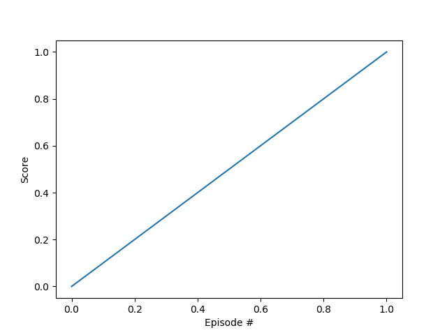

# Report
This report shortly summarizes the details of the deep reinforcement learning algorithm that was applied
to train an agent to navigate through and collect bananas in a large, square world. 

## Learning Algorithm

The agent is trained using a reinforcement learning technique called Q-learning to learn from the environment. 
The goal is to achieve the maximum expected "Future Discounted Reward" in this episodic task.
A policy *Q* (a mapping from state to action) is learned through repeated interaction with the environment which directly approximates the optimal policy *Q<sup>*</sup>*.  
A deep neural network, called deep Q-network, is used to create a function approximation of the values of the state-action pairs. The steps can be summarized as described [here](https://nervanasystems.github.io/coach/algorithms/value_optimization/dqn/):


1. Sample a batch of transitions from the replay buffer which stores previous experiences.
2. Using the next states from the sampled batch, a forward pass through the target network calculates the Q values for each of the actions Q(s<sub>t+1</sub>,a), and keep only the maximum value for each state.
3. In order to zero out the updates for the actions that were not played, use the current states from the sampled batch, and run the online network to get the current *Q* values predictions. Set those values as the targets for the actions that were not actually played.
4. For each action that was played, use the following equation for calculating the targets of the network:​
<a href="https://www.codecogs.com/eqnedit.php?latex=y_t=r(s_t,a_t)&plus;\gamma&space;\cdot&space;\max_a&space;Q(s_{t&plus;1},a)" target="_blank"></a>
5. Train the online network using the current states as inputs, and with the aforementioned targets.

Once in every few thousand steps, copy the weights from the online network to the target network.

### Network Architecture
The network is a simple fully connected network that maps the currently recognized state to an estimate of the Q-value of each of the four possible actions.
It consists of two hidden layers with 64 units with `ReLU` activations.

### Epsilon-greedy Policy
An epsilon-greedy action selection policy is employed to avoid local minima and allow exploration of the state space. The action with the currently predicted maximal reward is chosen with probability 1-&epsilon;, otherwise a state is chosen randomly.

### Hyperparameters
```
BUFFER_SIZE = int(1e5)  # replay buffer size
BATCH_SIZE = 64         # minibatch size
GAMMA = 0.99            # discount factor
TAU = 1e-3              # for soft update of target parameters
LR = 5e-4               # learning rate 
UPDATE_EVERY = 4        # how often to update the network
```

## Achieved Rewards
The agent was trained until an average reward of +15 was achieved. 
  
The plot shows the average rewards and its rolling mean. The agent is clearly able to learn how to handle the environment successfully.

## Ideas for Future Work
No real effort was spent on optimizing the various hyperparameters. A grid-search can be used to investigate their influence on the solution. A more interesting area of possible improvement is to implement more advanced techniques that were shown to
achieve superior results as discussed in [this paper](https://storage.googleapis.com/deepmind-media/dqn/DQNNaturePaper.pdf):
- Implement a double DQN, 
- Implement a dueling DQN, 
- Extend the method to use prioritized experience replay.